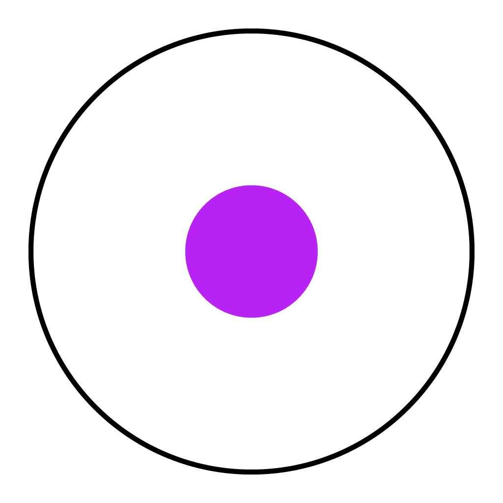

<a href="https://bafybeidk4zev2jlw2jijtdyufo3itspx45k4ynq634x4rjm6ycjfdvxfrq.ipfs.infura-ipfs.io/" title="Record">
  
</a>

# Record App

[](LICENSE) [](https://standardjs.com) [](https://github.com/RichardLitt/standard-readme)
[](https://app.fossa.io/projects/git%2Bgithub.com%2Fmistakia%2Frecord-app?ref=badge_shield)

> Desktop, mobile and web app for Record.

*Note: This repo is the React & React Native UI for [Record Node](https://github.com/mistakia/record-node).*

Record is a proof of concept immutable distributed system for audio files. Built entirely on [IPFS](https://github.com/ipfs/js-ipfs), user data is stored in a [scuttlebot](http://scuttlebot.io/)-esque immutable log via [IPFS-Log](https://github.com/orbitdb/ipfs-log) & [OrbitDB](https://github.com/orbitdb/orbit-db). Bootstraping/peer discovery is done via [bitboot](https://github.com/tintfoundation/bitboot).

At it's core, the application intends to be a media library management & playback system akin to [beets](https://github.com/beetbox/beets) with the ability to join various sources of music like [tomahawk player](https://github.com/tomahawk-player/tomahawk). By building everything on top of IPFS, it can become a connected network of libraries, opening the door to many other possibilities (i.e. distributed version of soundcloud & musicbrainz), while still being entirely distributed and thus being able to function permanently.

## Features
- Supports: mp3, mp4, m4a/aac, flac, wav, ogg, 3gpp, aiff
- Audio file tag support via [Music Metadata](https://github.com/Borewit/music-metadata)
- Audio fingerprinting via [Chromaprint](https://acoustid.org/chromaprint)
- Listening history w/ counter and timestamps
- Tagging system for organization
- Play / Shuffle search results & organizational tags
- Import files from the local file system
- Import from various web-based sources: Youtube, Soundcloud, Bandcamp, etc
  - [Record Chrome extension](https://github.com/mistakia/record-chrome-extension)
- Content deduplication
- Play queue

**Future Features**
- Metadata cleaning / import using: discogs, musicbrainz, last.fm, allmusic, beatport, streaming services, etc
- Media server (MPD, Sonos, Plex, Kodi, Emby)
- Audio and music analysis (Aubio, Essentia)
- Audio Scrobbling (last.fm, libre.fm, listenbrainz)
- Trustless timestamping / distributed copyrighting & distribution (OpenTimestamps, Nano, etc)

## More Info
- Read the [wiki](https://bafybeidk4zev2jlw2jijtdyufo3itspx45k4ynq634x4rjm6ycjfdvxfrq.ipfs.infura-ipfs.io/) for a primer.
- Check out [the roadmap](https://github.com/mistakia/record-app/projects/1) to view planned features.

## Install
```
yarn install
```

## Usage
### Desktop (Electron)
```
yarn start:electron
```

### Mobile (React Native)
First, install packages needed by nodejs-mobile:
```
yarn install:nodejs-mobile
```

Then, start react native packager with:
```
yarn start:rn
```

#### iOS
```
yarn build:ios // or `yarn build:ios:dev`
yarn start:ios // or open & build with xcode `open ios/Record.xcodeproj/`
```

#### Android
```
yarn build:android
yarn start:android
```

## License
MIT


[](https://app.fossa.io/projects/git%2Bgithub.com%2Fmistakia%2Frecord-app?ref=badge_large)
